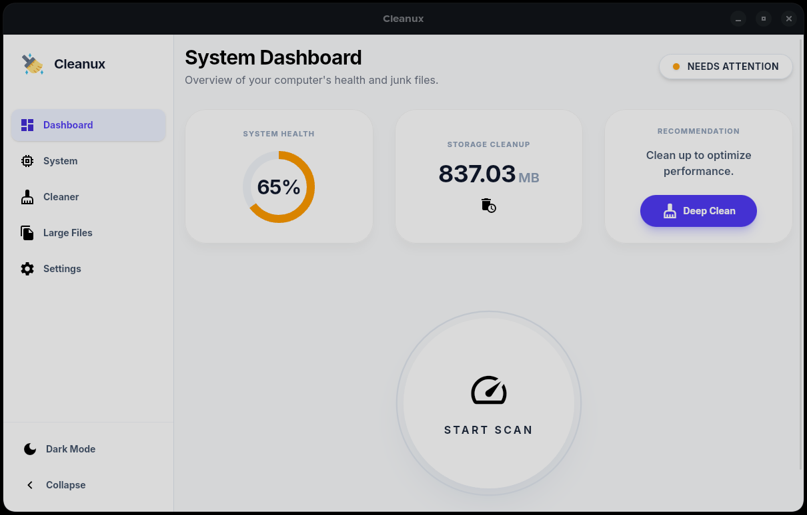
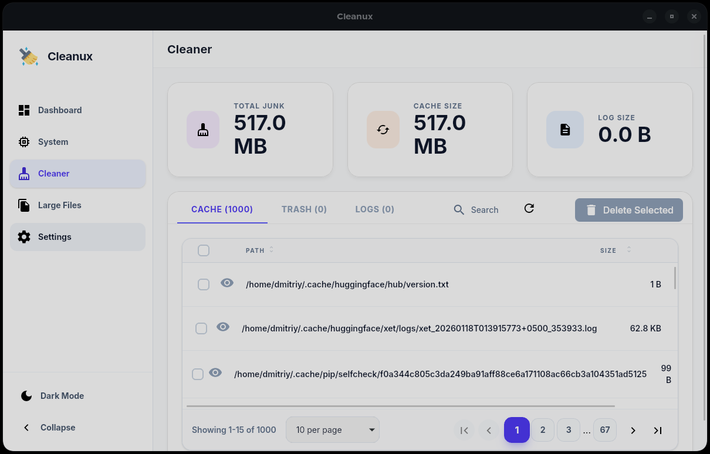
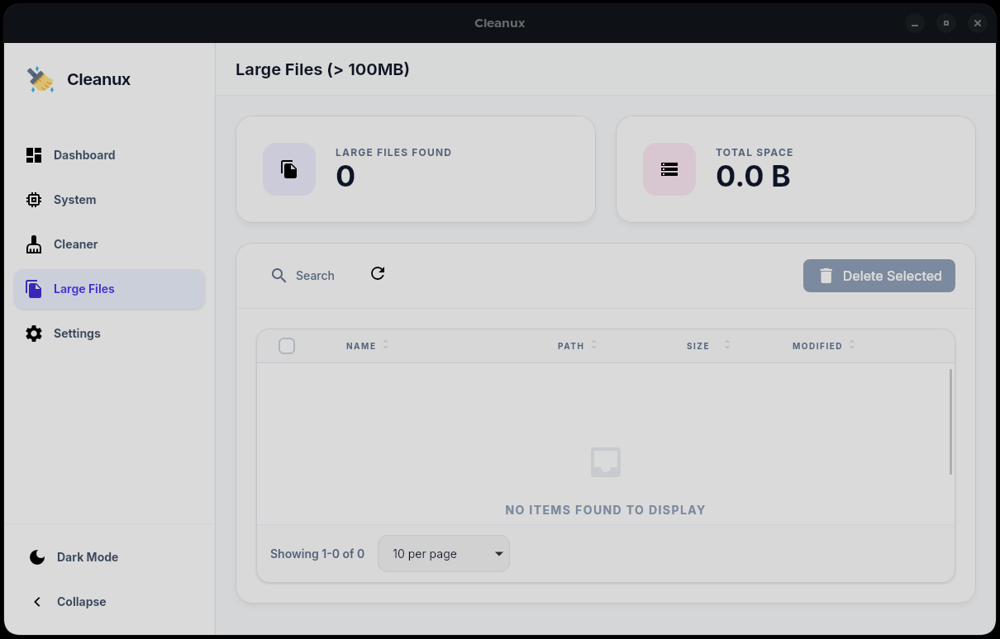
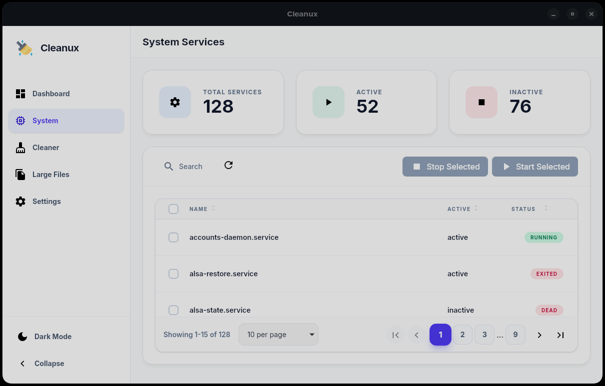
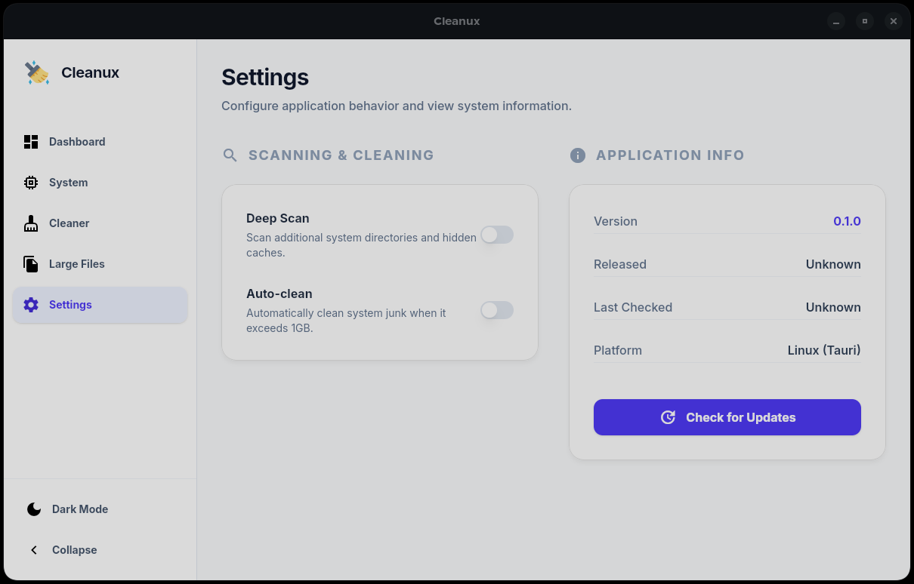

# Cleanux

Cleanux is a modern, high-performance system cleaning utility built with [Tauri v2](https://tauri.app/) that helps users maintain and optimize their Linux system efficiently. The application provides a premium user experience with a "glassmorphic" UI, real-time system scanning, and efficient junk file removal.

## Screenshots

<details>
  <summary>Spoiler</summary>
  <h3>Dashboard page</h3>
  
  <h3>Cleaner page</h3>
  
  <h3>Large Files page</h3>
  
  <h3>System page</h3>
  
  <h3>Settings page</h3>
  
</details>

## Features

- **System Dashboard**: Real-time overview of system health with a dynamic health score.
- **Deep Scanning**: Scan for cache files, system logs, trash items, and large files.
- **One-Click Clean**: Quickly remove all identified system junk with a single click.
- **Large File Finder**: Identify and manage files consuming significant disk space (>100MB).
- **Service Manager**: Monitor and manage system services with Start/Stop capabilities.
- **Glassmorphic UI**: Beautiful, modern design with smooth animations and dark mode support.
- **Cross-Platform**: Built on Tauri for a native experience with high performance and security.

## Tech Stack

- **Frontend**: Angular v21 (Standalone Components, Signals, Control Flow)
- **Backend**: Rust (Tauri v2, Tokio)
- **Styling**: TailwindCSS v4
- **Icons**: Material Icons

## Installation

#### Checking the installed tools to launch the project

First make sure you have Node.js installed.
To do this, open a command prompt or terminal and type the following commands:

```bash
node -v
```

```bash
npm -v
```

If you are using the bun package manager, then run this command:

```bash
bun -v
```

#### Installation dependencies

After that, go to the folder with this project and run the following command:

```bash
npm install
```

If you are using the bun package manager, then run this command:

```bash
bun install
```

#### Checking the Rust compiler

In order to run a Rust application, you need to make sure that you have a compiler for Rust.
To find out if you have one, enter the following command:

```bash
rustc --version
```

If you get an error instead of a version, it means that you don't have a Rust compiler. In order to set it up, go to the [official website](https://www.rust-lang.org/tools/install) and follow the instructions on the website.

## Usage

After installing the dependencies, use the following command to run, depending on the package manager you are using:

```bash
npm run tauri dev
```

Or

```bash
bun run tauri dev
```

## Build Optimization

This project includes optimizations to reduce build times and ensure high performance:

### Build Scripts

```bash
# Build desktop application
bun run tauri:build

# Clean all build artifacts
bun run build:clean
```

### Key Optimizations

1. **Incremental Compilation**: Rust code uses incremental compilation to avoid recompiling unchanged code.
2. **Modern Frontend Features**: Utilizes Angular v21 Signals and Control Flow for optimized change detection and performance.
3. **Rust Backend Security**: Critical operations like system cleaning and service management use `pkexec` for secure, system-native administrative authorization.

## Authors

- [Dmitriy303](https://github.com/rusnakdima)

## License

This project is licensed under the [MIT License](LICENSE.MD).

## Contact

If you have any questions or comments about this project, please feel free to contact us at [rusnakdima03@gmail.com](mailto:rusnakdima03@gmail.com).
